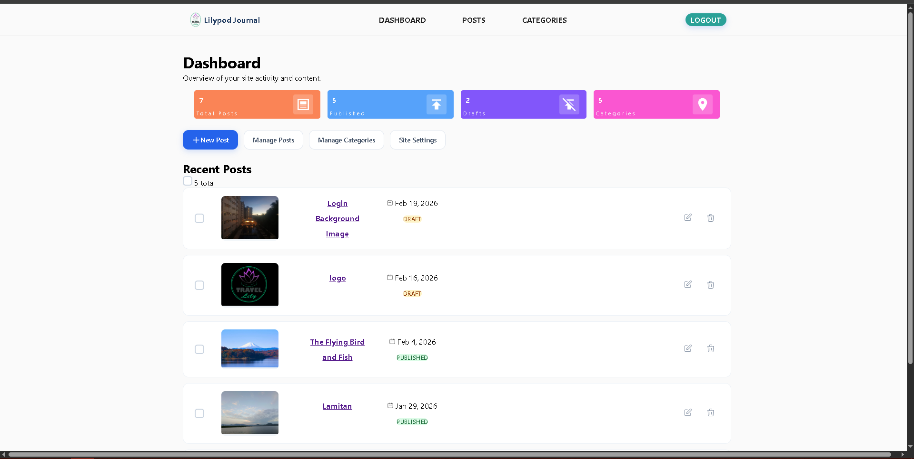
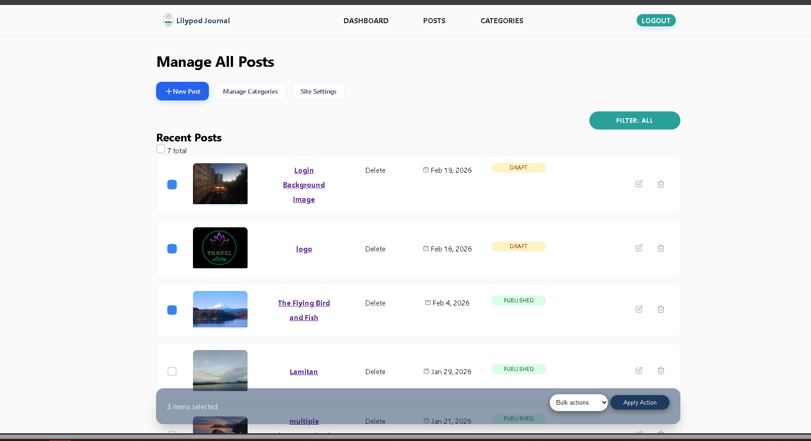
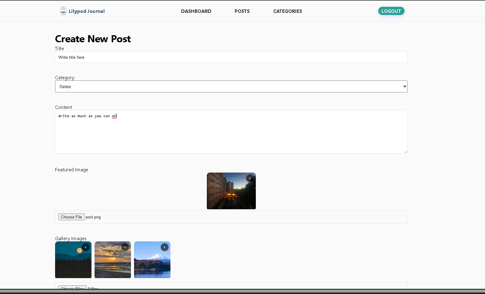
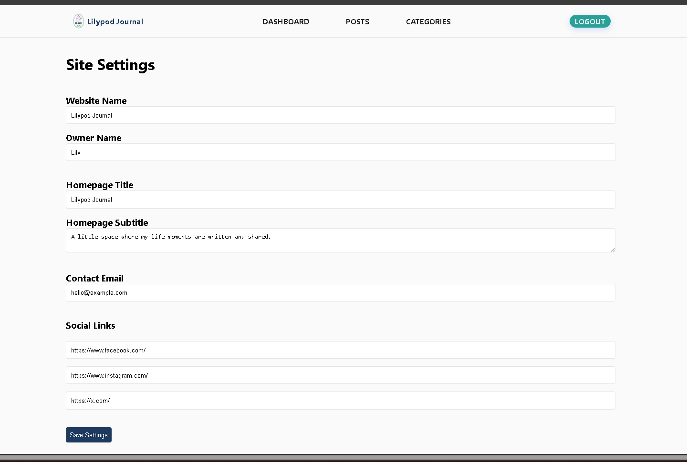
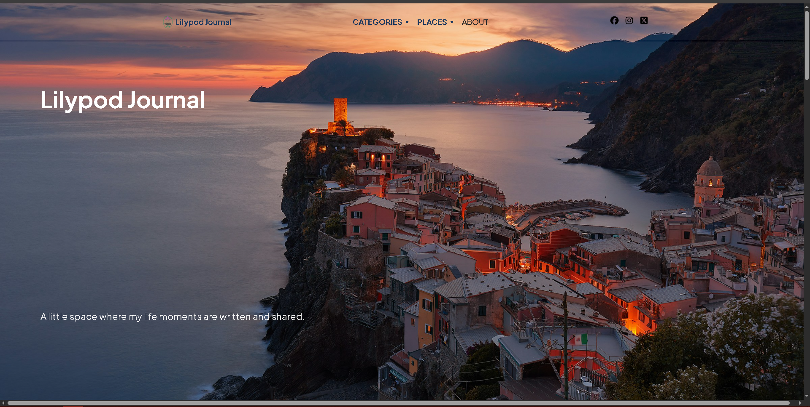
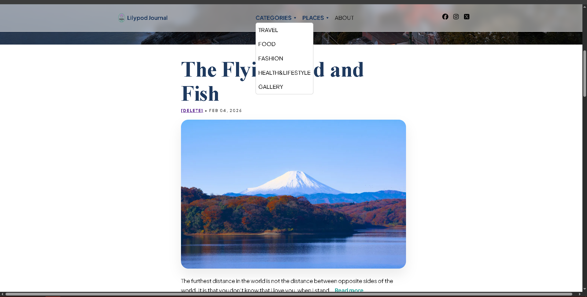

# Project overview
This is a custom travel blog CMS built from scratch using PHP and MySQL.  
The goal was to design something production-ready without relying on frameworks — focusing on architecture, security, and SEO rather than just basic CRUD.  
It includes a public blog and a secure admin panel for managing posts, categories, and site settings.   

# Tech stack
    HTML / CSS
    Vanilla JavaScript
    PHP (vanilla)
    MySQL
    PDO (prepared statements)
    No frameworks used.

# What It Does
    Create, edit, delete posts
    Manage categories
    Upload images securely
    Image compression
    Edit hero section, contact info, and social links
    Basic dashboard with site stats
    Pagination for blog posts
    Mobile responsive
    XML sitemap generation

# Security features
    Passwords hashed with password_hash
    CSRF protection on all POST forms
    Prepared statements everywhere
    Session hardening
    MIME validation for uploads
    Randomized filenames for images
    Basic login throttling
    Security headers enabled
    Foreign key constraints for data integrity

# SEO features
    Custom meta title and description per post
    Canonical URLs
    Open Graph tags (for social sharing)
    JSON-LD structured data
    Dynamic sitemap
    Unique slug enforcement

# Admin features
    Auth system
    CSRF protection
    Secure uploads
    Image compression
    SEO meta system
    Sitemap
    Settings control
    Category integrity
    Pagination
    Security headers

# Screenshots
    Dashboard

    Post management

    Create/edit post

    Settings page

    Public homepage

# Possible Improvements
    Role-based access control
    Soft delete system
    Activity logging
    Contact form handling
    Caching layer
